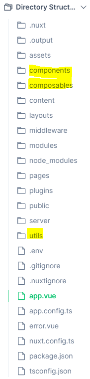
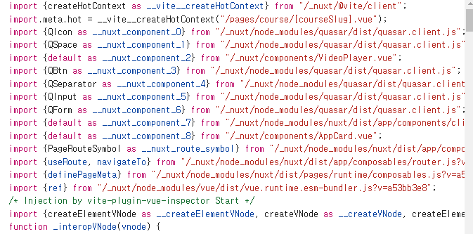

# [Vue 강의 끝판왕 : Nuxt 3 완벽 마스터 | 짐코딩 - 인프런](https://www.inflearn.com/course/vue-끝판왕-nuxt3-완벽마스터)
- 강의교안
   - [Vue 강의 끝판왕 : Nuxt 3 완벽 마스터 | 짐코딩 - 인프런](https://www.inflearn.com/course/vue-끝판왕-nuxt3-완벽마스터)
- 소스코드
  - [짐코딩 클럽 - 가장 쉬운 웹 개발 입문](https://www.gymcoding.co/)
  https://github.com/gymcoding/learn-nuxt-3


# 내용 정리
## 4-2 Nuxt Plugins & Utils
### plugins
- Nuxt는 자동으로 `plugins/` 디렉토리의 파일을 읽어와 Vue 애플리케이션 생성 시에 로드합니다.
- `plugins/` 디렉토리 내의 모든 플러그인은 자동으로 등록되며, 별도로 `nuxt.config`에 추가 할 필요가 없습니다.

### 등록된 플러그인
- 해당 디렉토리의 최상위 레벨에 있는 파일 또는 하위 디렉토리 내의 index 파일만 자동으로 플러그인으로 등록됩니다.
```html
-| plugins/
---| foo.ts      // 스캔 대상인 플러그인
---| bar/
-----| baz.ts    // 스캔되지 않는 플러그인
-----| foz.vue   // 스캔되지 않는 Vue 파일
-----| index.ts  // 현재는 스캔되고 있지만, 사용이 권장되지 않는(deprecated) 상태인 플러그인입니다.
``` 

### 플러그인 만들어서 쓰기

---

```jsx
// plugins/hello.ts
export default defineNuxtPlugin(nuxtApp => {
	// nuxtApp으로 어떤 작업을 할 수 있습니다.
})
```

### 객체 구문 플러그인 정의 가능

고급 사용 사례를 위해 객체 구문을 사용하여 플러그인을 정의하는 것도 가능합니다.

```jsx
export default defineNuxtPlugin({
  name: 'my-plugin',
  enforce: 'pre', // 또는 'post'
  async setup(nuxtApp) {
    // 이 부분은 일반적인 함수형 플러그인의 동등한 부분입니다.
  },
  hooks: {
    // 여기에서 Nuxt 앱 런타임 훅을 직접 등록할 수 있습니다.
    'app:created'() {
      const nuxtApp = useNuxtApp()
      // 훅 내에서 작업 수행
    }
  },
  env: {
    // 이 값을 `false`로 설정하면 서버 전용 렌더링 또는 아일랜드 컴포넌트에서 플러그인을 실행하지 않습니다.
    islands: true
  }
})
```

위 코드는 Nuxt3에서 플러그인을 정의하는 방법을 나타냅니다.

1. **name**: 플러그인의 이름을 지정합니다. 이것은 플러그인을 식별하는 데 사용됩니다.
2. **enforce**: 플러그인이 언제 실행되어야 하는지를 나타냅니다. `pre`로 설정하면 프레임워크 내부에서 사용되는 플러그인보다 먼저 실행되고, `post`로 설정하면 나중에 실행됩니다.
3. **setup**: 플러그인의 메인 기능을 정의하는 부분입니다. 비동기 함수로서, Nuxt 애플리케이션을 초기화할 때 실행됩니다.
4. **hooks**: Nuxt 앱 런타임 훅을 직접 등록할 수 있습니다. 여기서는 `app:created` 훅을 사용하고 있으며, 앱이 생성될 때 실행됩니다.
5. **env**: 플러그인이 실행되는 환경을 제어하는데 사용됩니다. 예를 들어, `islands` 속성이 `true`로 설정되면 서버 전용 렌더링이나 아일랜드 컴포넌트에서만 플러그인이 실행됩니다.

이러한 플러그인 정의는 Nuxt3의 모듈 시스템과 함께 사용되어 효율적이고 모듈화된 코드를 작성할 수 있게 해줍니다.


```html
만약 객체 구문을 사용한다면, 속성들은 나중에 정적으로 분석되어 더 최적화된 빌드를 생성할 수 있습니다. 
그래서 런타임시 속성을 정의해서는 안 됩니다. 예를 들어, 
[ enforce: process.server ? 'pre' : 'post' ] 와 같이 설정하면 
Nuxt가 향후 플러그인에 대해 수행할 최적화를 방해할 수 있습니다.

```

### 등록 순서 설정
- 플러그인이 등록되는 순서를 제어하려면 파일 이름에 '알파벳 순'으로 번호를 붙이면 됩니다.
  ```html
  plugins/
   | - 01.myPlugin.ts
   | - 02.myOtherPlugin.ts
  ```

### 플러그인 로딩전략
- 기본적으로 Nuxt는 플러그인을 순차적으로 로드합니다.
- 플러그인을 병렬로 정의하여 Nuxt가 다음 플러그인을 로드하기 전에 플러그인 실행이 끝날 필요가 없도록 할 수 있습니다.
```javascript
export default defineNuxtPlugin({
  name: 'my-plugin',
  parallel: true,
  async setup(nuxtApp) {
    // 다음 플러그인은 즉시 실행될 것입니다.
  }
})
```

### Composables 사용
- Nuxt 플러그인 내에서는 composables와 utils를 모두 사용할 수 있습니다.
```javascript
// plugins/hello.ts
export default defineNuxtPlugin((nuxtApp) => {
  const foo = useFoo()
})
```
- 제한 사항과 차이점
  - 특정 컴포저블이 나중에 등록된 다른 플러그인에 의존하는 경우 - 작동 불가
    - 플러그인은 순차적으로 순서대로 호출되며 모든 것보다 먼저 호출됩니다.
    - 특정 컴포저블이 다른 플러그인에 의존하는데 해당 플러그인이 아직 호출되지 않았다면 문제가 발생할 수 있습니다.
  - 특정 컴포저블이 Vue.js 라이프사이클에 의존하는 경우 - 작동 불가
    - 일반적으로 Vue.js의 컴포저블은 현재 컴포넌트 인스턴스에 바인딩되는 반면, 플러그인은 오직 nuxtApp 인스턴스에만 바인딩되기 때문에 동작하지 않을 수 있다.

### 외부 라이브러리 Autoimport
-  외부 라이브러리는 autoimport 지원을 안합니다. 그래서 nuxt.config.ts에 설정 해주면 가능합니다. (vue-i18n 적용 예시)

```javascript
  imports: {
    presets: [
      {
        from: 'vue-i18n',
        imports: ['useI18n'],
      },
    ],
  },
```
```javascript
const {locale} = useI18n();
const selectedLanguageName =
  computed(() => languages.value.find((lang) => lang.code == locale.value)?.name,
  );
```

### utils

`utils/` 디렉토리를 사용하여 애플리케이션 전체에서 유틸리티 함수를 자동으로 가져올 수 있습니다.

---

[**`utils/` 디렉터리**](https://nuxt.com/docs/guide/directory-structure/utils)의 주요 목적은 Vue composables와 다른 자동으로 가져온 유틸리티 함수 간의 의미론적 구분을 허용하는 것입니다.

### 사용법

**방법 1:** **named export** 사용

```jsx
// utils/index.ts
export const { format: formatNumber } = Intl.NumberFormat('en-GB', {
	notation: 'compact',
	maximumFractionDigits: 1
});
```

**방법 2: default export** 사용

```jsx
// utils/random-entry.ts 또는 utils/randomEntry.ts
// randomEntry()로 사용 가능합니다.
export default function (arr: Array<any>) {
  return arr[Math.floor(Math.random() * arr.length)]
}
```

이제 `.js`, `.ts` 및 `.vue` 파일에서 자동으로 가져온 유틸리티 함수를 사용할 수 있습니다.

**사용예시**

```html
// app.vue
<template>
  <p>{{ formatNumber(1234) }}</p>
</template>
```

💡 [Read more in **Docs > Guide > Concepts > Auto Imports**.](https://nuxt.com/docs/guide/concepts/auto-imports)

💡 Read and edit a live example in [**Docs > Examples > Features > Auto Imports**](https://nuxt.com/docs/examples/features/auto-imports).

💡 `utils/` 디렉토리의 자동 가져오기 작업과 검색 방식은 `composables/` 디렉토리와 동일합니다.

⚠️ 이러한 유틸리티 함수는 앱의 Vue 부분 내에서만 사용할 수 있습니다. `server/` 디렉토리에서는 오직 `server/utils`가 자동으로 가져와집니다.

--- 

## 4-3 Auto-imports
- Nuxt는 컴포넌트, 컴포저블 그리고 Vue.js API를 자동으로 가져와서 명시적으로 import하지 않고도 애플리케이션 전체에서 사용할 수 있도록 합니다.
```javascript
// app.vue
<script setup lang="ts">
const count = ref(1) // ref is auto-imported
</script>
```

- 독창적인 디렉터리 구조 덕분에 Nuxt는 components/, composables/ 및 utils/ 디렉터리의 리소스를 자동으로 가져올 수 있습니다.
- 전역 선언과 달리 Nuxt는 입력, 빌드 시 실제 사용하는 코드만 import 할 수 있도록 지원합니다.
- `nuxt.config` 파일의 `imports` 섹션을 구성하여 사용자 정의 폴더 또는 타사 패키지에서 내보낸 기능을 자동으로 가져올 수도 있습니다.



- 개발자도구에서 확인된 소싀. 아래 사진과 같이 자동 import 된걸 확인 할 수 있다. 


### [**Auto-imports 비활성화**](https://nuxt.com/docs/guide/concepts/auto-imports#disabling-auto-imports)

- 컴포저블 및 유틸리티 자동 가져오기를 사용 중지하려면 `nuxt.config` 파일에서 `imports.autoImport`를 `false`로 설정하면 됩니다.
```javascript
// nuxt.config.ts
export default defineNuxtConfig({
  components: {
    dirs: []
  }
})
```

### [**third-party 패키지 Auto-import**](https://nuxt.com/docs/guide/concepts/auto-imports#auto-import-from-third-party-packages)

- Nuxt는 타사(third-party) 패키지에서 Auto-import를 허용합니다.
- 예를 들어 다음과 같이 vue-i18n 패키지에서 useI18n 컴포저블 함수를 Auto-import 사용 설정할 수 있습니다.
```javascript
// nuxt.config.ts
export default defineNuxtConfig({
  imports: {
    presets: [
      {
        from: 'vue-i18n',
        imports: ['useI18n']
      }
    ]
  }
})
```
--- 
## 4-4 Rendering Modes
https://nuxt.com/docs/guide/concepts/rendering
- Nuxt는 다양한 렌더링 모드를 지원하고, 환경구성의 한 줄 설정으로 렌더링 모드를 전환할 수 있습니다. 
- Universal rendering
- Client-Side Rendering
- Hybrid Rendering
- Edge-Side Rendering

### Universal rendering
- 서버사이드 장점 + 싱글페이지 장점 결합
  - 브라우저 범용(universal)(server-side + client-side)
- 초기 로딩 속도 빠르게함
- 검색 엔진 최적화
- 빠른 렌더링 
```javascript
// nuxt.config.ts
export default defineNuxtConfig({
  ssr: true // default  
})
```
--- 
## 4-5 Hydration
https://ko.vuejs.org/guide/scaling-up/ssr#server-side-rendering-ssr
- Nuxt3에서 하이드레이션은 서버에서 렌더링된 HTML을 클라이언트에서 동적으로 완성하는 과정
- 하이드레이션을 통해 서버에서 렌더링된 HTML에 JavaScript를 추가하여 사용자 입력에 반응하거나 데이터를 동적으로 업데이트할 수 있다.

---
## 5-1 에러 던지기 - createError Error Utilss
### 파라미터

- `err`
    
    ```jsx
    createError({
      cause, // 에러의 원인 (다른 에러 객체 또는 메시지 등)
      data, // 추가적인 에러 데이터 (사용자 정의 데이터)
      message, // 에러 메시지 (문제에 대한 간결한 설명)
      name, // 에러의 이름 또는 유형 (예: 'ValidationError')
      stack, // 에러 스택 트레이스 (발생한 위치와 호출 스택)
      statusCode, // HTTP 상태 코드 (예: 404, 500)
      statusMessage, // HTTP 상태 메시지 (예: 'Not Found', 'Internal Server Error')
      fatal // 에러가 치명적인지 여부 (페이지를 완전히 중지시킬지 여부)
    })
    ```
    

### In **Vue App**

`createError`로 생성된 오류를 던질 경우:

- 서버 측에서는 전체 화면 오류 페이지를 트리거하며, `clearError`를 사용하여 해당 오류 페이지를 지울 수 있다.
- 클라이언트 측에서는 처리할 수 있는 비치명적인 오류를 발생시킵니다. 만약 전체 화면 오류 페이지를 트리거해야 한다면, `fatal: true`로 설정할 수 있다.

**예시**

```jsx
// pages/movies/[slug].vue
<script setup lang="ts">
const route = useRoute()
const { data } = await useFetch(`/api/movies/${route.params.slug}`)
if (!data.value) {
  throw createError({
		statusCode: 404,
		statusMessage: '페이지를 찾을 수 없습니다'
	})
}
</script>
```
클라이언트 측에서 만약 전체 화면 오류 페이지를 트리거해야 한다면, `fatal: true`로 설정할 수 있습니다.

- 수정 `pages/course/[courseSlug].vue`
    
### In **API Routes**

`createError`를 사용하여 서버 API Routes에서 오류 처리를 트리거합니다.

- **API Routes란?**
  - Nuxt 3에서 백엔드 엔드포인트(API)를 만들거나 데이터를 처리하기 위한 서버 측 로직을 작성하는 데 사용됩니다.
  - API Routes를 사용하면 `/api` 디렉토리 내에 간단한 JavaScript 파일을 생성하여 API 엔드포인트를 정의할 수 있습니다. 이렇게 정의된 API는 Nuxt 애플리케이션 내에서 사용되거나 외부에서 접근할 수 있는 엔드포인트로 동작합니다. 
  - 이를테면, `/api/users.js` 파일을 만들어 사용자 정보를 처리하는 간단한 API를 작성할 수 있습니다. 이 API는 서버 측에서 실행되면서 데이터를 동적으로 생성하거나 외부 데이터베이스와 상호 작용할 수 있습니다. 
  - API Routes는 Nuxt 3에서 간편하게 생성하고 사용할 수 있어서, 백엔드 로직을 프론트엔드 애플리케이션과 통합하는 데 유용합니다.

**예시:**

```jsx
export default eventHandler(() => {
  throw createError({
    statusCode: 404,
    statusMessage: '페이지를 찾을 수 없습니다'
  })
})
```

참고 [Docs > Getting Started > Error Handling](https://nuxt3-docs.netlify.app/guide/views#error-handling)

---
## 5-2 에러 페이지 정의 (with useError, clearError)
### Error Page 커스터마이징
- 루트 디렉토리에 ~/error.vue 파일을 추가
- 에러페이지라고 불리지만 route가 아니며  `~/pages `디렉토리에 위치해서는 안 된다.
- 이와 같은 이유로 이 페이지에서는 `definePageMeta`를 사용해서는 안된다.

### error 객체 제공 필드
```json
{
  url: string
  statusCode: number
  statusMessage: string
  message: string
  description: string
  data: any
}
```
### 에러 객체 사용자 정의 필드 설정
- 사용자 정의 필드에 오루가 있으면 손실되기에 데이터를 할당해야한다.

  ```javascript
  throw createError({
    statusCode: 404,
    statusMessage: 'Page Not Found',
    data: {
      myCustomField: true
    }
  })
  ```
  
### Error Utils - useError
- `useError` 컴포저블은 처리 중인 전역 Nuxt에러 객체를 반환한다.
- 클라이언트 및 서버에서 모두 사용 할 수 있다.
  ```javascript
  const error = useError()
  ``` 
- 상태에 에러를 성정하고 컴포넌트 간에 반응적이면서 SSR에 친화적인 전역 Nuxt 오류를 생성한다.
  - 속성
    ```javascript
    interface {
      //  HTTP response status code
      statusCode: number
      // HTTP response status message
      statusMessage: string
      // Error message
      message: string
    }

### Error Utils - clearError
- pages, components, 그리고 plugins에서 clearError를 사용하여 모든 에러를 지우고 사용자를 `리디렉션`할 수 있다.
  - 파라미터
    - `opitons: { redirect?: string }`
      - 선택적인 경로를 제공하여 사용자 리디렉션 가능
        ```javascript
        // 리디렉션 없이
        clearError()
      
        // 리디렉션 포함
        clearError({ redirect: '/homepage' })
        ```
      - 에러는 `useError()`를 사용하여 상태에 설정됨 
      - `clearError` 컴포저블은 이 상태를 재설정하고 제공된 옵션으로 `app:error:cleared`훅 호출

### 참고
- [Get Started > Error Handling # Error Page](https://nuxt.com/docs/getting-started/error-handling#error-page)
- [API > Utils > clearError](https://nuxt.com/docs/api/utils/clear-error)
- [API > Utils > createError](https://nuxt.com/docs/api/utils/create-error)
- [API > Composables > useError](https://nuxt.com/docs/api/composables/use-error)
--- 
## 5-3 Error Handling (with Lifecycle hooks)
### Lifecyle Hooks
- 애플리케이션의 다양한 단계에서 코드를 실행하거나 사용자 지정 로직을 삽입할 수 있는 지점들
- 이 훅들은 앱의 초기화, 라우팅, 렌더링, 상태 변경, 에러 발생 등과 같은 중요한 이벤트에 효과적으로 끼어들 수 있게 한다.
```javascript
export default defineNuxtPlugin(nuxtApp => {
	nuxtApp.hook('app:created', () => {
		// 초기 vueApp 인스턴스가 생성될 때 호출됩니다.
  });
  nuxtApp.hook('vue:error', (err) => {
    // vue 에러가 루트 컴포넌트에 전파될 때 호출됩니다.
  })
})
```
https://nuxt.com/docs/api/advanced/hooks
https://nuxt.com/docs/guide/going-further/hooks

### Error Handling
- 사용자 정의 오류의 경우 페이지/컴포넌트의 setup 함수에서 호출하는 것이 좋다.
- onErrorCaptured 컴포저블 또는 nuxt 플러그인에서 구성할 수 있는 vue:error 런타임 nuxt 후크를 사용 권장 
```javascript
export default defineNuxtPlugin(nuxtApp => {
  nuxtApp.hook('vue:error', (err) => {
    //
  })
})
```
- 에러 페이지 제거
  - clearError 헬퍼 함수를 호출
    - 선택적으로 리디렉션할 경로를 파라미터로 받는다. 


> Node 16에서 에러페이지를 렌더링할 때 쿠키를 설정하면, 이전에 설정된 쿠기를 덮어쓸 수 있다. Node 16은 2023년 9월에 지원 종료되었으므로, 새로운 Node 버전을 사용하는 것이 좋다.

### 참고
 - [Get Started > Error Handling # Error Page](https://nuxt.com/docs/getting-started/error-handling#error-page)
 - [Guide > Going > Lifecycle Hooks](https://nuxt.com/docs/guide/going-further/hooks)
 - [API > Advanced > Lifecycle Hooks](https://nuxt.com/docs/api/advanced/hooks)
 - [Quasar > Notify](https://quasar.dev/quasar-plugins/notify)

--- 
