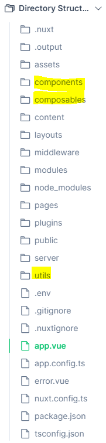
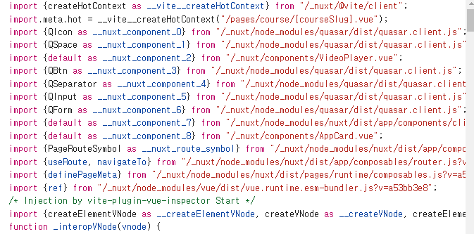
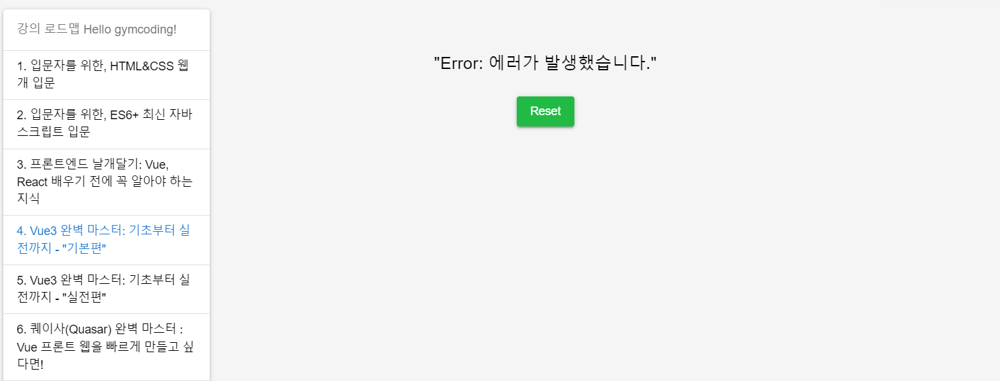

## Vue2와 Vue3의 차이점

> 처음 Vue 를 시작한다면 Vue2부터 시작하는걸 추천한다고합니다. (Vue3 는 Vue2를 사용하며 클린코드를 지향하는 느낌)
> 
- 라이브러리 내부 로직을 vue3에는 전부 다 타입스크립트 기반으로 재작성
- 주요 개발 도구들 변경 - 전반적인 생태계 변화
- 컴포지션 API, Teleport 등 새로운 문법 지원 - 개발 시 선택지 증가
- 리액티비티 시스템 기반 API 변경
- 공식 문서 변경
- 신규 프로젝트는 Vue3로 하는 추세
- Vue2를 Vue3로 마이그레이션 많이 함

### Vue.js 2

1. **가장 안정적인 버전:** Vue.js 2는 오랜 기간 동안 사용되어 검증된 안정성을 가지고 있습니다.
2. **Options API:** Vue.js 2에서 주로 사용되는 API로써, 각 컴포넌트의 데이터, 메서드, 라이프사이클 훅을 단일 객체에 정의하는 방식입니다.
3. **데이터 반응성:** Vue.js 2는 양방향 데이터 바인딩을 지원하고, 데이터가 변경되면 자동으로 UI가 업데이트됩니다.
4. **가상 DOM(Virtual DOM):** 변경된 데이터를 효율적으로 감지하고 DOM을 업데이트하여 성능을 최적화합니다.
5. **커뮤니티와 생태계:** Vue.js 2는 활발한 커뮤니티와 다양한 생태계를 가지고 있습니다.

### Vue.js 3

1. **Composition API:** Vue.js 3에서 도입된 새로운 API로써, 컴포넌트의 로직을 더 선언적이고 유연하게 구성할 수 있습니다. Composition API는 코드의 재사용성을 높이고 가독성을 향상시킵니다.
2. **성능 향상:** Vue.js 3는 가상 DOM의 효율성을 높이고, 렌더링 성능을 개선하여 더 빠른 애플리케이션을 구축할 수 있습니다.
3. **Tree-shaking 지원:** Vue.js 3는 모듈화된 구조를 통해 필요한 코드만 번들링하여 불필요한 코드를 제거할 수 있도록 지원합니다.
4. **TypeScript 지원:** Vue.js 3는 TypeScript를 더욱 강력하게 지원하여 타입 안정성을 향상시킵니다.
5. **Vue Router와 Vuex의 개선:** Vue.js 3에는 Vue Router와 Vuex도 함께 업그레이드되어 API의 개선과 성능 향상이 이루어졌습니다.
6. **기타 새로운 기능:** Vue.js 3에는 Teleport, Suspense, Fragments와 같은 새로운 기능도 추가되었습니다.

### 뷰3이 추구하는 방향은 크게 2가지로 요약 가능

- 컴포넌트 코드 재사용성 향상
- 타입스크립트 문법 지원

### Vu3 3에서 달라진 것 크게 5가지

- Teleport(Vue Portal과 유사합니다)
- 템플릿 표현식 관련 추가 문법 제공
- Suspense
- Reactivity 주입 API
- 그리고 Composition API

### 결론

Vue.js 2는 안정성과 다양한 생태계를 제공하는 반면, Vue.js 3는 성능과 개발 효율성을 향상시키는 많은 새로운 기능과 개선된 API를 제공합니다. 프로젝트의 요구 사항과 팀의 개발 경험에 따라 적합한 버전을 선택하는 것이 중요합니다. 새로운 프로젝트를 시작하는 경우에는 Vue.js 3를 고려해보는 것이 좋습니다.

--- 
# [Vue 강의 끝판왕 : Nuxt 3 완벽 마스터 | 짐코딩 - 인프런](https://www.inflearn.com/course/vue-끝판왕-nuxt3-완벽마스터)
- 강의교안
   - [Vue 강의 끝판왕 : Nuxt 3 완벽 마스터 | 짐코딩 - 인프런](https://www.inflearn.com/course/vue-끝판왕-nuxt3-완벽마스터)
- 소스코드
  - [짐코딩 클럽 - 가장 쉬운 웹 개발 입문](https://www.gymcoding.co/)
  https://github.com/gymcoding/learn-nuxt-3


# 내용 정리

### 프로젝트 생성

---

1. `nuxi`를 이용하여 프로젝트를 생성합니다.

```json
npx nuxi@latest init learn-nuxt-3
```

1. `cd learn-nuxt-3` 프로젝트 디렉터리로 이동
2. `npm install` 의존성 패키지 설치
3. `npm run dev` 프로젝트 실행

💡 **nuxi 란?**

- `npx nuxi build`와 `nuxt build`는 둘 다 Nuxt 3 애플리케이션을 빌드하는 명령어이지만, 약간의 차이가 있습니다.
    1. **`npx nuxi build`**
        - `nuxi`는 Nuxt 3에서 사용되는 공식 빌드 도구입니다.
        - 이 명령어는 프로젝트에 종속성을 추가하지 않고도 `nuxi`를 실행할 수 있게 해주는 `npx`를 사용합니다. `npx`는 npm 패키지를 설치하지 않고도 일회성으로 실행할 수 있도록 도와줍니다.
        - 최신 기능 및 최적화된 빌드 프로세스를 사용하여 프로덕션 빌드를 생성합니다.
        
        ```bash
        npx nuxi build
        ```
        
    2. **`nuxt build`**
        - 이 명령어는 이전 버전의 Nuxt.js에서 사용되었던 빌드 명령어입니다.
        - Nuxt 3에서도 여전히 호환성을 제공하기 위해 제공되지만, 공식적으로는 `nuxi`를 권장합니다.
        - 이 명령어를 사용하려면 먼저 `nuxt` 패키지가 프로젝트의 의존성으로 설치되어 있어야 합니다.
        
        ```bash
        nuxt build
        ```
        
    
    따라서, 새로운 프로젝트에서는 `npx nuxi build`를 사용하는 것이 권장되며, 이전 버전의 Nuxt.js 프로젝트에서는 `nuxt build`를 계속 사용할 수 있습니다.
    
</aside>

--- 
## 4-2 Nuxt Plugins & Utils
### plugins
- Nuxt는 자동으로 `plugins/` 디렉토리의 파일을 읽어와 Vue 애플리케이션 생성 시에 로드합니다.
- `plugins/` 디렉토리 내의 모든 플러그인은 자동으로 등록되며, 별도로 `nuxt.config`에 추가 할 필요가 없습니다.

### 등록된 플러그인
- 해당 디렉토리의 최상위 레벨에 있는 파일 또는 하위 디렉토리 내의 index 파일만 자동으로 플러그인으로 등록됩니다.
```html
-| plugins/
---| foo.ts      // 스캔 대상인 플러그인
---| bar/
-----| baz.ts    // 스캔되지 않는 플러그인
-----| foz.vue   // 스캔되지 않는 Vue 파일
-----| index.get.ts  // 현재는 스캔되고 있지만, 사용이 권장되지 않는(deprecated) 상태인 플러그인입니다.
``` 

### 플러그인 만들어서 쓰기

---

```javascript
// plugins/hello.ts
export default defineNuxtPlugin(nuxtApp => {
	// nuxtApp으로 어떤 작업을 할 수 있습니다.
})
```

### 객체 구문 플러그인 정의 가능

고급 사용 사례를 위해 객체 구문을 사용하여 플러그인을 정의하는 것도 가능합니다.

```javascript
export default defineNuxtPlugin({
  name: 'my-plugin',
  enforce: 'pre', // 또는 'post'
  async setup(nuxtApp) {
    // 이 부분은 일반적인 함수형 플러그인의 동등한 부분입니다.
  },
  hooks: {
    // 여기에서 Nuxt 앱 런타임 훅을 직접 등록할 수 있습니다.
    'app:created'() {
      const nuxtApp = useNuxtApp()
      // 훅 내에서 작업 수행
    }
  },
  env: {
    // 이 값을 `false`로 설정하면 서버 전용 렌더링 또는 아일랜드 컴포넌트에서 플러그인을 실행하지 않습니다.
    islands: true
  }
})
```

위 코드는 Nuxt3에서 플러그인을 정의하는 방법을 나타냅니다.

1. **name**: 플러그인의 이름을 지정합니다. 이것은 플러그인을 식별하는 데 사용됩니다.
2. **enforce**: 플러그인이 언제 실행되어야 하는지를 나타냅니다. `pre`로 설정하면 프레임워크 내부에서 사용되는 플러그인보다 먼저 실행되고, `post`로 설정하면 나중에 실행됩니다.
3. **setup**: 플러그인의 메인 기능을 정의하는 부분입니다. 비동기 함수로서, Nuxt 애플리케이션을 초기화할 때 실행됩니다.
4. **hooks**: Nuxt 앱 런타임 훅을 직접 등록할 수 있습니다. 여기서는 `app:created` 훅을 사용하고 있으며, 앱이 생성될 때 실행됩니다.
5. **env**: 플러그인이 실행되는 환경을 제어하는데 사용됩니다. 예를 들어, `islands` 속성이 `true`로 설정되면 서버 전용 렌더링이나 아일랜드 컴포넌트에서만 플러그인이 실행됩니다.

이러한 플러그인 정의는 Nuxt3의 모듈 시스템과 함께 사용되어 효율적이고 모듈화된 코드를 작성할 수 있게 해줍니다.


```html
만약 객체 구문을 사용한다면, 속성들은 나중에 정적으로 분석되어 더 최적화된 빌드를 생성할 수 있습니다. 
그래서 런타임시 속성을 정의해서는 안 됩니다. 예를 들어, 
[ enforce: process.server ? 'pre' : 'post' ] 와 같이 설정하면 
Nuxt가 향후 플러그인에 대해 수행할 최적화를 방해할 수 있습니다.

```

### 등록 순서 설정
- 플러그인이 등록되는 순서를 제어하려면 파일 이름에 '알파벳 순'으로 번호를 붙이면 됩니다.
  ```html
  plugins/
   | - 01.myPlugin.ts
   | - 02.myOtherPlugin.ts
  ```

### 플러그인 로딩전략
- 기본적으로 Nuxt는 플러그인을 순차적으로 로드합니다.
- 플러그인을 병렬로 정의하여 Nuxt가 다음 플러그인을 로드하기 전에 플러그인 실행이 끝날 필요가 없도록 할 수 있습니다.
```javascript
export default defineNuxtPlugin({
  name: 'my-plugin',
  parallel: true,
  async setup(nuxtApp) {
    // 다음 플러그인은 즉시 실행될 것입니다.
  }
})
```

### Composables 사용
- Nuxt 플러그인 내에서는 composables와 utils를 모두 사용할 수 있습니다.
```javascript
// plugins/hello.ts
export default defineNuxtPlugin((nuxtApp) => {
  const foo = useFoo()
})
```
- 제한 사항과 차이점
  - 특정 컴포저블이 나중에 등록된 다른 플러그인에 의존하는 경우 - 작동 불가
    - 플러그인은 순차적으로 순서대로 호출되며 모든 것보다 먼저 호출됩니다.
    - 특정 컴포저블이 다른 플러그인에 의존하는데 해당 플러그인이 아직 호출되지 않았다면 문제가 발생할 수 있습니다.
  - 특정 컴포저블이 Vue.js 라이프사이클에 의존하는 경우 - 작동 불가
    - 일반적으로 Vue.js의 컴포저블은 현재 컴포넌트 인스턴스에 바인딩되는 반면, 플러그인은 오직 nuxtApp 인스턴스에만 바인딩되기 때문에 동작하지 않을 수 있다.

### 외부 라이브러리 Autoimport
-  외부 라이브러리는 autoimport 지원을 안합니다. 그래서 nuxt.config.ts에 설정 해주면 가능합니다. (vue-i18n 적용 예시)

```javascript
  imports: {
    presets: [
      {
        from: 'vue-i18n',
        imports: ['useI18n'],
      },
    ],
  },
```
```javascript
const {locale} = useI18n();
const selectedLanguageName =
  computed(() => languages.value.find((lang) => lang.code == locale.value)?.name,
  );
```

### utils

`utils/` 디렉토리를 사용하여 애플리케이션 전체에서 유틸리티 함수를 자동으로 가져올 수 있습니다.

---

[**`utils/` 디렉터리**](https://nuxt.com/docs/guide/directory-structure/utils)의 주요 목적은 Vue composables와 다른 자동으로 가져온 유틸리티 함수 간의 의미론적 구분을 허용하는 것입니다.

### 사용법

**방법 1:** **named export** 사용

```javascript
// utils/index.get.ts
export const { format: formatNumber } = Intl.NumberFormat('en-GB', {
	notation: 'compact',
	maximumFractionDigits: 1
});
```

**방법 2: default export** 사용

```javascript
// utils/random-entry.ts 또는 utils/randomEntry.ts
// randomEntry()로 사용 가능합니다.
export default function (arr: Array<any>) {
  return arr[Math.floor(Math.random() * arr.length)]
}
```

이제 `.js`, `.ts` 및 `.vue` 파일에서 자동으로 가져온 유틸리티 함수를 사용할 수 있습니다.

**사용예시**

```html
// app.vue
<template>
  <p>{{ formatNumber(1234) }}</p>
</template>
```

💡 [Read more in **Docs > Guide > Concepts > Auto Imports**.](https://nuxt.com/docs/guide/concepts/auto-imports)

💡 Read and edit a live example in [**Docs > Examples > Features > Auto Imports**](https://nuxt.com/docs/examples/features/auto-imports).

💡 `utils/` 디렉토리의 자동 가져오기 작업과 검색 방식은 `composables/` 디렉토리와 동일합니다.

⚠️ 이러한 유틸리티 함수는 앱의 Vue 부분 내에서만 사용할 수 있습니다. `server/` 디렉토리에서는 오직 `server/utils`가 자동으로 가져와집니다.

--- 

## 4-3 Auto-imports
- Nuxt는 컴포넌트, 컴포저블 그리고 Vue.js API를 자동으로 가져와서 명시적으로 import하지 않고도 애플리케이션 전체에서 사용할 수 있도록 합니다.
```javascript
// app.vue
<script setup lang="ts">
const count = ref(1) // ref is auto-imported
</script>
```

- 독창적인 디렉터리 구조 덕분에 Nuxt는 components/, composables/ 및 utils/ 디렉터리의 리소스를 자동으로 가져올 수 있습니다.
- 전역 선언과 달리 Nuxt는 입력, 빌드 시 실제 사용하는 코드만 import 할 수 있도록 지원합니다.
- `nuxt.config` 파일의 `imports` 섹션을 구성하여 사용자 정의 폴더 또는 타사 패키지에서 내보낸 기능을 자동으로 가져올 수도 있습니다.



- 개발자도구에서 확인된 소싀. 아래 사진과 같이 자동 import 된걸 확인 할 수 있다. 


### [**Auto-imports 비활성화**](https://nuxt.com/docs/guide/concepts/auto-imports#disabling-auto-imports)

- 컴포저블 및 유틸리티 자동 가져오기를 사용 중지하려면 `nuxt.config` 파일에서 `imports.autoImport`를 `false`로 설정하면 됩니다.
```javascript
// nuxt.config.ts
export default defineNuxtConfig({
  components: {
    dirs: []
  }
})
```

### [**third-party 패키지 Auto-import**](https://nuxt.com/docs/guide/concepts/auto-imports#auto-import-from-third-party-packages)

- Nuxt는 타사(third-party) 패키지에서 Auto-import를 허용합니다.
- 예를 들어 다음과 같이 vue-i18n 패키지에서 useI18n 컴포저블 함수를 Auto-import 사용 설정할 수 있습니다.
```javascript
// nuxt.config.ts
export default defineNuxtConfig({
  imports: {
    presets: [
      {
        from: 'vue-i18n',
        imports: ['useI18n']
      }
    ]
  }
})
```
--- 
## 4-4 Rendering Modes
https://nuxt.com/docs/guide/concepts/rendering
- Nuxt는 다양한 렌더링 모드를 지원하고, 환경구성의 한 줄 설정으로 렌더링 모드를 전환할 수 있습니다. 
- Universal rendering
- Client-Side Rendering
- Hybrid Rendering
- Edge-Side Rendering

### Universal rendering
- 서버사이드 장점 + 싱글페이지 장점 결합
  - 브라우저 범용(universal)(server-side + client-side)
- 초기 로딩 속도 빠르게함
- 검색 엔진 최적화
- 빠른 렌더링 
```javascript
// nuxt.config.ts
export default defineNuxtConfig({
  ssr: true // default  
})
```
--- 
## 4-5 Hydration
https://ko.vuejs.org/guide/scaling-up/ssr#server-side-rendering-ssr
- Nuxt3에서 하이드레이션은 서버에서 렌더링된 HTML을 클라이언트에서 동적으로 완성하는 과정
- 하이드레이션을 통해 서버에서 렌더링된 HTML에 JavaScript를 추가하여 사용자 입력에 반응하거나 데이터를 동적으로 업데이트할 수 있다.

---
# 5. Error Handling
## 5-1 에러 던지기 - createError Error Utilss
### 파라미터

- `err`
    
    ```javascript
    createError({
      cause, // 에러의 원인 (다른 에러 객체 또는 메시지 등)
      data, // 추가적인 에러 데이터 (사용자 정의 데이터)
      message, // 에러 메시지 (문제에 대한 간결한 설명)
      name, // 에러의 이름 또는 유형 (예: 'ValidationError')
      stack, // 에러 스택 트레이스 (발생한 위치와 호출 스택)
      statusCode, // HTTP 상태 코드 (예: 404, 500)
      statusMessage, // HTTP 상태 메시지 (예: 'Not Found', 'Internal Server Error')
      fatal // 에러가 치명적인지 여부 (페이지를 완전히 중지시킬지 여부)
    })
    ```
    

### In **Vue App**

`createError`로 생성된 오류를 던질 경우:

- 서버 측에서는 전체 화면 오류 페이지를 트리거하며, `clearError`를 사용하여 해당 오류 페이지를 지울 수 있다.
- 클라이언트 측에서는 처리할 수 있는 비치명적인 오류를 발생시킵니다. 만약 전체 화면 오류 페이지를 트리거해야 한다면, `fatal: true`로 설정할 수 있다.

**예시**

```javascript
// pages/movies/[slug].vue
<script setup lang="ts">
const route = useRoute()
const { data } = await useFetch(`/api/movies/${route.params.slug}`)
if (!data.value) {
  throw createError({
		statusCode: 404,
		statusMessage: '페이지를 찾을 수 없습니다'
	})
}
</script>
```
클라이언트 측에서 만약 전체 화면 오류 페이지를 트리거해야 한다면, `fatal: true`로 설정할 수 있습니다.

- 수정 `pages/course/[courseSlug].vue`
    
### In **API Routes**

`createError`를 사용하여 서버 API Routes에서 오류 처리를 트리거합니다.

- **API Routes란?**
  - Nuxt 3에서 백엔드 엔드포인트(API)를 만들거나 데이터를 처리하기 위한 서버 측 로직을 작성하는 데 사용됩니다.
  - API Routes를 사용하면 `/api` 디렉토리 내에 간단한 JavaScript 파일을 생성하여 API 엔드포인트를 정의할 수 있습니다. 이렇게 정의된 API는 Nuxt 애플리케이션 내에서 사용되거나 외부에서 접근할 수 있는 엔드포인트로 동작합니다. 
  - 이를테면, `/api/users.js` 파일을 만들어 사용자 정보를 처리하는 간단한 API를 작성할 수 있습니다. 이 API는 서버 측에서 실행되면서 데이터를 동적으로 생성하거나 외부 데이터베이스와 상호 작용할 수 있습니다. 
  - API Routes는 Nuxt 3에서 간편하게 생성하고 사용할 수 있어서, 백엔드 로직을 프론트엔드 애플리케이션과 통합하는 데 유용합니다.

**예시:**

```javascript
export default eventHandler(() => {
  throw createError({
    statusCode: 404,
    statusMessage: '페이지를 찾을 수 없습니다'
  })
})
```

참고 [Docs > Getting Started > Error Handling](https://nuxt3-docs.netlify.app/guide/views#error-handling)

---
## 5-2 에러 페이지 정의 (with useError, clearError)
### Error Page 커스터마이징
- 루트 디렉토리에 ~/error.vue 파일을 추가
- 에러페이지라고 불리지만 route가 아니며  `~/pages `디렉토리에 위치해서는 안 된다.
- 이와 같은 이유로 이 페이지에서는 `definePageMeta`를 사용해서는 안된다.

### error 객체 제공 필드
```json
{
  url: string
  statusCode: number
  statusMessage: string
  message: string
  description: string
  data: any
}
```
### 에러 객체 사용자 정의 필드 설정
- 사용자 정의 필드에 오루가 있으면 손실되기에 데이터를 할당해야한다.

  ```javascript
  throw createError({
    statusCode: 404,
    statusMessage: 'Page Not Found',
    data: {
      myCustomField: true
    }
  })
  ```
  
### Error Utils - useError
- `useError` 컴포저블은 처리 중인 전역 Nuxt에러 객체를 반환한다.
- 클라이언트 및 서버에서 모두 사용 할 수 있다.
  ```javascript
  const error = useError()
  ``` 
- 상태에 에러를 성정하고 컴포넌트 간에 반응적이면서 SSR에 친화적인 전역 Nuxt 오류를 생성한다.
  - 속성
    ```javascript
    interface {
      //  HTTP response status code
      statusCode: number
      // HTTP response status message
      statusMessage: string
      // Error message
      message: string
    }

### Error Utils - clearError
- pages, components, 그리고 plugins에서 clearError를 사용하여 모든 에러를 지우고 사용자를 `리디렉션`할 수 있다.
  - 파라미터
    - `opitons: { redirect?: string }`
      - 선택적인 경로를 제공하여 사용자 리디렉션 가능
        ```javascript
        // 리디렉션 없이
        clearError()
      
        // 리디렉션 포함
        clearError({ redirect: '/homepage' })
        ```
      - 에러는 `useError()`를 사용하여 상태에 설정됨 
      - `clearError` 컴포저블은 이 상태를 재설정하고 제공된 옵션으로 `app:error:cleared`훅 호출

### 참고
- [Get Started > Error Handling # Error Page](https://nuxt.com/docs/getting-started/error-handling#error-page)
- [API > Utils > clearError](https://nuxt.com/docs/api/utils/clear-error)
- [API > Utils > createError](https://nuxt.com/docs/api/utils/create-error)
- [API > Composables > useError](https://nuxt.com/docs/api/composables/use-error)
--- 
## 5-3 Error Handling (with Lifecycle hooks)
### Lifecyle Hooks
- 애플리케이션의 다양한 단계에서 코드를 실행하거나 사용자 지정 로직을 삽입할 수 있는 지점들
- 이 훅들은 앱의 초기화, 라우팅, 렌더링, 상태 변경, 에러 발생 등과 같은 중요한 이벤트에 효과적으로 끼어들 수 있게 한다.
```javascript
export default defineNuxtPlugin(nuxtApp => {
	nuxtApp.hook('app:created', () => {
		// 초기 vueApp 인스턴스가 생성될 때 호출됩니다.
  });
  nuxtApp.hook('vue:error', (err) => {
    // vue 에러가 루트 컴포넌트에 전파될 때 호출됩니다.
  })
})
```
https://nuxt.com/docs/api/advanced/hooks
https://nuxt.com/docs/guide/going-further/hooks

### Error Handling
- 사용자 정의 오류의 경우 페이지/컴포넌트의 setup 함수에서 호출하는 것이 좋다.
- onErrorCaptured 컴포저블 또는 nuxt 플러그인에서 구성할 수 있는 vue:error 런타임 nuxt 후크를 사용 권장 
```javascript
export default defineNuxtPlugin(nuxtApp => {
  nuxtApp.hook('vue:error', (err) => {
    //
  })
})
```
- 에러 페이지 제거
  - clearError 헬퍼 함수를 호출
    - 선택적으로 리디렉션할 경로를 파라미터로 받는다. 


> Node 16에서 에러페이지를 렌더링할 때 쿠키를 설정하면, 이전에 설정된 쿠기를 덮어쓸 수 있다. Node 16은 2023년 9월에 지원 종료되었으므로, 새로운 Node 버전을 사용하는 것이 좋다.

### 참고
 - [Get Started > Error Handling # Error Page](https://nuxt.com/docs/getting-started/error-handling#error-page)
 - [Guide > Going > Lifecycle Hooks](https://nuxt.com/docs/guide/going-further/hooks)
 - [API > Advanced > Lifecycle Hooks](https://nuxt.com/docs/api/advanced/hooks)
 - [Quasar > Notify](https://quasar.dev/quasar-plugins/notify)

--- 
## 5-4 Error Utils - showError
- pages, components 그리고 plugins 클라이언트 측에서 showError를 사용하여 에러 페이지를 표시할 수 있다.

### 파라미터
- error - 문자열 또는 에러 객체 (부분적인 속성을 포함할 수 있음)
  ```javascript
  // 문자열로 간단한 에러 표시
  showError("😱 Oh no, an error has been thrown.");
  
  // 객체를 사용하여 더 많은 메타데이터 전달
  showError({
    statusCode: 404,
    statusMessage: "Page Not Found"
  });
  ```
- `useError()`를 사용하여 상태 설정함.
- 컴포넌트 간에 반응적이고 SSR에 친화적인 에러 상태 생성
- `showError는` `app:error` 훅을 호출한다.

### `showError` vs `createError`
- Nuxt3에서 에러를 다루는 두 가지 방법
  - createError
    - 서버에서 발생한 에러 처리
    - 에러 객체 생성 및 더 많은 메타데이터 포함 가능
    - 서버에서 에러를 던지면 전체 화면 에러 페이지를 트리거 한다.
    - 클라이언트에선 사용자가 처리할 수 있는 비치명적인 에러를 던짐
    - 예시 소스 : 404 에러 생성 처리
    ```javascript
    throw createError({
      statusCode: 404,
      statusMessage: 'Page Not Found',
      data: {
        myCustomField: true
      }
    });
    ```   
  - showError
    - 클라이언트에서 특정 시점에 에러 페이지를 표시하는데 사용 됨
    - 클라이언트에서 언제든지 호출할 수 있는 함수
    - 에러를 처리하고 에러 페이지를 트리거한다.
    - 주로 클라이언트 측에서 직접 호출하거나 미들웨어, 플러그인, `setup()` 함수 등에서 사용된다.
    ```javascript
    showError({
      statusCode: 404,
      statusMessage: 'Page Not Found'
    });
    ```
--- 
## 5-5 클라이언트 오류 처리 (NuxtErrorBoundary)
- 특정 UI에 오류 처리 할 때 사용


### 이벤트
- 컴포넌트의 기본 슬롯에서 오류가 발생했을 때 처리됨.
```html
<template>
  <NuxtErrorBoundary @error="logSomeError">
    <!-- ... -->
  </NuxtErrorBoundary>
</template>
```

### 슬롯
- 오류가 발생했을 때 표시할 대체 콘텐츠를 지정하는데 사용됨
```html
<template>
  <NuxtErrorBoundary>
    <!-- ... -->
    <template #error="{ error }">
      <p>오류가 발생했습니다: {{ error }}</p>
    </template>
  </NuxtErrorBoundary>
</template>
```
### 참고
https://nuxt.com/docs/api/components/nuxt-error-boundary

--- 
## 5-6 Route Validation
- 유효성 검사를 하기 위해 `definePageMeta()` 함수의 `validate` 속성을 사용할 수 있다.
```javascript
<script setup lang="ts">
definePageMeta({
  validate: async (route) => {
    // id가 숫자로 이루어져 있는지 확인
    return /^\\d+$/.test(route.params.id)
  }
})
</script>
``` 
--- 
# 6. Route Middleware and Authentication
## 6-1 Route Middleware 기초
### Middleware
- 특정 라우트로 이동하기 전에 실행하고 싶은 코드를 추출하는 데 이상적이다.

### Route Middleware 3가지 종류
- Anonymous (or inline) Middleware
  - 익명(또는 인라인) 라우트 미들웨어는 페이지에서 직접 정의
- Named Middleware
  - `middleware/` 에 배치되고 페이지에서 사용될 때  `astnchoronous import` (비동기로 가져옴)를 통해 자동으로 로드됨
      - 라우트 미들웨어 이름은 케밥 케이스로 표기됨으로 `someMiddleware` ->` some-middleware` 가 된다.
- Global Middleware
  -  `middleware/` 디렉토리에 배치되어 (`.global` 접미사와 함께) 모든 라우트 변경 시 자동으로 실행

> 라우트 미들웨어는 Nuxt 앱의 Vue 부분 내에서 실행된다. 비슷한 이름이지만, 이것들은 Nitro 서버 부분에서 실행되는 서버 미들웨어와 완전히 다르다.
Route Middleware ≠ Server Middleware

### validate 를 middleware로 리펙토링
- `pages/course/[courseSlug].vue` - `validate` → `middleware`
```javascript

// ... 생략 ...
definePageMeta({
  key: (route) => route.fullPath,
  // title: title.value, // 이렇게 하면 오류가 발생합니다.
  title: 'My home page',
  pageType: '',
  // keepalive: true,
  alias: ['/lecture/:courseSlug'],
  // validate: (route) => {
  middleware: (route) => {
    const courseSlug = route.params.courseSlug as string;
    const { course } = useCourse(courseSlug);
    if (!course) {
			// 1] client: protect, server: 404
			// return false;

			// 2] server: navigation
      // if (process.server) {
      //   return navigateTo('/');
      // }

			// 3] client: protect, server: error
      return abortNavigation(
        createError({
          statusCode: 404,
          statusMessage: 'Course not found',
        }),
      );
    }
    // return true;
  },
});
// ... 생략 ...
``` 
|  | Client-side Rendering | Server-side Rendering |
| --- | --- | --- |
| abortNavigation() | 현재 페이지 탐색을 중단합니다. | 에러 페이지를 표시합니다. (404) |
| abortNavigation(error) | 현재 페이지 탐색을 중단합니다. | 주어진 정보와 함께 에러 페이지를 표시합니다. |
> 
> validate은 라우트의 유효성을 확인하고 페이지를 로드하는 데 사용되는 반면, middleware는 페이지에 대한 추가적인 로직이나 데이터를 처리하는 데 사용됩니다.
> 따라서 라우트 유효성 검사와 페이지에 대한 사용자 지정 동작을 구현할 때 적절한 것을 선택해야 합니다.
### 참고
https://nuxt.com/docs/guide/directory-structure/middleware

--- 
## 미들웨어 실행 시점
- 서버사이드 한번 실행 -> 클라이언트에서 다시 실행
- 해당 동작 피하고 싶은 경우 아래 코드 삽입
```javascript
// middleware/example.ts
export default defineNuxtRouteMiddleware(to => {
  // 서버에서 미들웨어 건너뛰기
  if (process.server) return
  // 클라이언트 측에서 미들웨어 전체 건너뛰기
  if (process.client) return
  // 또는 초기 클라이언트 로드에서만 미들웨어 건너뛰기
  const nuxtApp = useNuxtApp()
  if (process.client && nuxtApp.isHydrating && nuxtApp.payload.serverRendered) return
})

```

### Global & Dynamic Middleware
### **Middleware 실행 순서**

Middleware는 다음과 같은 순서로 실행됩니다.

1. **Global Middleware:** 모든 라우트에 적용되는 Middleware입니다.
2. **Page defined middleware order:** 페이지 정의된 미들웨어 순서 (배열 구문으로 여러 미들웨어를 선언한 경우)

예를 들어, 다음과 같은 미들웨어 및 컴포넌트가 있다고 가정합니다.

```bash
middleware/
--| analytics.global.ts
--| setup.global.ts
--| auth.ts
```

```html
// **pages/profile.vue:**
<script setup lang="ts">
definePageMeta({
  middleware: [
    function (to, from) {
      // Custom inline middleware
    },
    'auth',
  ],
});
</script>
```

이 경우 다음과 같은 순서로 미들웨어가 실행됩니다.

1. **analytics.global.ts**
2. **setup.global.ts**
3. **Custom inline middleware**
4. **auth.ts**

### **Global Middleware 순서 지정**

기본적으로 Global Middleware는 파일 이름을 기준으로 알파벳순으로 실행됩니다.

하지만 특정 순서를 정의하고 싶을 때가 있습니다. 예를 들어, 마지막 시나리오에서 **setup.global.ts** 가 **analytics.global.ts** 보다 먼저 실행되어야 할 수도 있습니다. 그러한 경우 Global Middleware 앞에 '알파벳순' 번호를 붙이는 것이 좋습니다.

```bash
middleware/
--| 01.setup.global.ts
--| 02.analytics.global.ts
--| auth.ts
```

만약 '알파벳순' 번호를 처음 사용한다면 파일 이름은 숫자 값으로 정렬되지 않고 문자열로 정렬된다는 점을 기억하십시오. 예를 들어, **10.new.global.ts** 는 **2.new.global.ts** 보다 먼저 실행됩니다. 이것이 예제에서 한 자리 숫자 앞에 **0** 를 붙이는 이유입니다.

### **동적으로 미들웨어 추가**

---

플러그인 내에서 `addRouteMiddleware()` 헬퍼 함수를 사용하여 전역 또는 명명된 라우트 미들웨어를 수동으로 추가할 수 있습니다.

```javascript
export default defineNuxtPlugin(() => {
  addRouteMiddleware('global-test', () => {
    console.log('this global middleware was added in a plugin and will be run on every route change')
  }, { global: true })

  addRouteMiddleware('named-test', () => {
    console.log('this named middleware was added in a plugin and would override any existing middleware of the same name')
  })
})
```
--- 
# 7. State Management
## 7-1 Nuxt 상태관리 : useState()
### useState()
- `ref` 대신 사용 가능, SSR 친화적 
- 서버 렌더링 후 유지되고 고유 키를 사용하여 모튼 컴포넌트에 공유된다. (동일한 반응형 상태 공유)
  - useState 내부의 데이터는 JSON으로 직렬화되므로 클래스, 함수, 심볼 등 직렬화할 수 없는 어떤 것도 포함하지 않는 것이 중요

### clearNuxtState()
- `useState` 컴포저블을 사용하여 생성된 캐시된 상태를 삭제한다.
- 특정 상태 또는 모든 상태를 삭제하는 데 사용 가능

**타입:**

**TypeScript**

```tsx
clearNuxtState(keys?: string | string[] | ((key: string) => boolean)): void
```

**매개변수:**

- **keys (선택적):** 삭제할 `useState` 키 하나 또는 키 배열. 키를 지정하지 않으면 모든 상태가 삭제.
- **키 선택 옵션:**
    - **문자열:** 삭제할 단일 키 지정
    - **문자열 배열:** 여러 개의 키를 삭제하도록 지정
    - **함수:** 각 키를 검사하여 삭제할지 여부를 결정하는 함수. 함수는 키를 인자로 받고 `true` 또는 `false`를 반환해야 함.

**사용 시점:**

- `useState` 상태를 무효화해야 하는 경우
- 새로운 데이터로 상태를 업데이트하기 전에 이전 데이터를 지우고 싶은 경우
- `useState` 상태가 더 이상 필요 없는 경우

**예시:**

**TypeScript**

```tsx
// 모든 상태 삭제
clearNuxtState();

// 특정 키의 상태 삭제
clearNuxtState('counter');

// 조건에 따라 키 삭제
clearNuxtState((key) => key.startsWith('user'));

```

**주의:**

- `clearNuxtState`는 **클라이언트 측에서만** 작동
- `clearNuxtState`는 **SSR 시점에서 캐시된 상태만 삭제한다.** 서버 측 렌더링 중에 `useState`를 사용하여 설정된 상태는 영향을 받지 않다.
- `clearNuxtState`를 사용하면 애플리케이션 성능이 저하될 수 있다. 성능 문제가 발생하는 경우 특정 키만 삭제하는 것이 좋다.

## 7-2 useRequestHeaders 컴포저블
- useRequestHeaders를 사용하여 들어오는 요청 헤더에 액세스함 
- pages, components, plugins 내에서 들어오는 요청 헤더에 액세스하기 위한 내장 컴포저블
```javascript
// 모든 요청 헤더를 가져옵니다.
const headers = useRequestHeaders()

// 쿠키 요청 헤더를 가져옵니다.
const headers = useRequestHeaders(['cookie'])
```
- 예제
```javascript
<script setup lang="ts">
const { data } = await useFetch('/api/confidential', {
  headers: useRequestHeaders(['authorization'])
})
</script>
```
## Pinia - Typescript

---

상태를 TS와 호환되도록 만들려면 많은 일을 할 필요가 없습니다. 엄격한 모드([**`strict`**](https://www.typescriptlang.org/tsconfig#strict)) 또는 최소한 [**`noImplicitThis`**](https://www.typescriptlang.org/tsconfig#noImplicitThis)가 활성화되어 있는지 확인하고, Pinia는 자동으로 상태의 타입을 추론합니다! 그러나 몇 가지 경우에는 명시적인 캐스팅이 필요할 수 있습니다.

```tsx
export const useUserStore = defineStore('user', {
  state: () => {
    return {
      // 초기에 빈 리스트를 위한 경우
      userList: [] as UserInfo[],
      // 아직 로드되지 않은 데이터를 위한 경우
      user: null as UserInfo | null,
    }
  },
})

interface UserInfo {
  name: string
  age: number
}

```

만약 원한다면, 상태를 인터페이스로 정의하고 state()의 반환 값에 유형을 명시할 수 있습니다:

```tsx
interface State {
  userList: UserInfo[]
  user: UserInfo | null
}

export const useUserStore = defineStore('user', {
  state: (): State => {
    return {
      userList: [],
      user: null,
    }
  },
})

interface UserInfo {
  name: string
  age: number
}

```

여기서는 초기에 빈 리스트를 위한 경우나 아직 로드되지 않은 데이터를 다룰 때 명시적인 캐스팅을 하는 것이 필요한 상황입니다.
--- 

### pinia 상태 유지 플러그인 설치
1. pinia-plugin-persistedstate 설치
    
    ```tsx
    npm i -D @pinia-plugin-persistedstate/nuxt
    ```
    
2. `nuxt.config.js` 설정
    
    ```tsx
    export default defineNuxtConfig({
      modules: [
        '@pinia/nuxt', // needed
        '@pinia-plugin-persistedstate/nuxt',
      ]
    })
    ```
   
---
# 8. Server Routes - Course API
```shell
// 디렉토리 구조
-| server/
---| api/
-----| hello.ts      # /api/hello 경로에 매핑됩니다.
---| routes/
-----| bonjour.ts    # /bonjour 경로에 매핑됩니다.
---| middleware/
-----| log.ts        # 모든 요청을 기록합니다.
```

### Catch-all Route

Catch-all routes는 fallback route 처리에 유용합니다. 예를 들어, `~/server/api/foo/[...].ts`라는 파일을 만들면 `/api/foo/bar/baz`와 같은 모든 요청에 대한 캐치올 라우트가 등록됩니다.

```jsx
// server/api/foo/[...].ts
export default defineEventHandler((event) => {
  // event.context.path로 라우트 경로 가져오기: '/api/foo/bar/baz'
  // event.context.params._로 라우트 세그먼트 가져오기: 'bar/baz'
  return `Default foo handler`
})

```

캐치올 라우트에 이름을 설정하려면 `~/server/api/foo/[...slug].ts`와 같이 사용하고 `event.context.params.slug`을 통해 액세스할 수 있습니다.

```jsx
// server/api/foo/[...slug].ts
export default defineEventHandler((event) => {
  // event.context.params.slug로 라우트 세그먼트 가져오기: 'bar/baz'
  return `Default foo handler`
})

```
